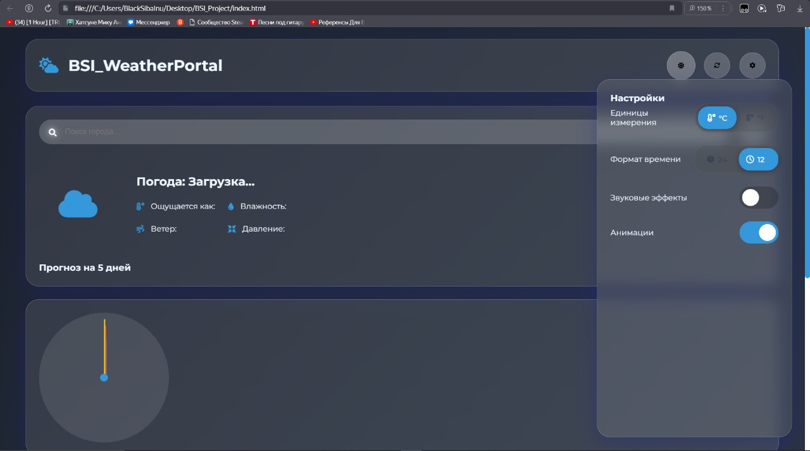

# BSI_WeatherPortal_Template - Современный Шаблон Метеорологического Портала



## 📝 Описание
BSI_WeatherPortal_Template - это современный, готовый к использованию шаблон веб-приложения для создания метеорологических порталов. Проект разработан с использованием современных веб-технологий и отличается стильным минималистичным дизайном, плавными анимациями и интуитивно понятным интерфейсом.

## ✨ Основные особенности
- **Стильный Glass Morphism дизайн**
- **Адаптивная верстка** для всех устройств
- **Анимированные переключатели настроек**
- **Двойной режим отображения** (светлая/темная тема)
- **Интеграция с OpenWeatherMap API**
- **Локальное хранение настроек**

## 🛠 Технологический стек
- HTML5
- CSS3 (Flexbox, CSS Grid, CSS Variables)
- JavaScript (ES6+)
- OpenWeatherMap API
- Local Storage
- Service Workers

## 🎨 Особенности дизайна
- Эффект Glass Morphism
- Плавные анимации переходов
- Кастомные элементы управления
- Интерактивные визуальные эффекты [в некоторых частей кода есть комментарий для подробного установки звуковых инструкций.]
- Адаптивная цветовая схема

## 🚀 Быстрый старт
1. Клонируйте репозиторий:
bash
git clone https://github.com/blacksibainu/BSI_WeatherPortal_Template.git


2. Настройте API ключ в файле script.js:
javascript
this.apiKey = 'YOUR_API_KEY'


3. Запустите на локальном сервере

## 💻 Структура проекта
```
BSI_WeatherPortal_Template/
├── index.html
├──  styles.css
├── script.js
├──service-worker.js
└── README.md
```


## 📱 Совместимость
- Chrome (последние версии)
- Firefox (последние версии)
- Safari (последние версии)
- Edge (последние версии)
- Мобильные браузеры [есть немного деффекта в мобильных устроиствах.]

## 📄 Лицензия
MIT License. Подробности в файле [LICENSE](LICENSE).

## 📊 Статус проекта


## 🙏 Благодарности
- OpenWeatherMap за предоставление API
- Font Awesome за иконки
- Сообществу разработчиков за поддержку [ABU - Corp]

---
⭐ Если вам понравился шаблон, не забудьте поставить звезду!

*Создано с ❤ для сообщества BSI*
